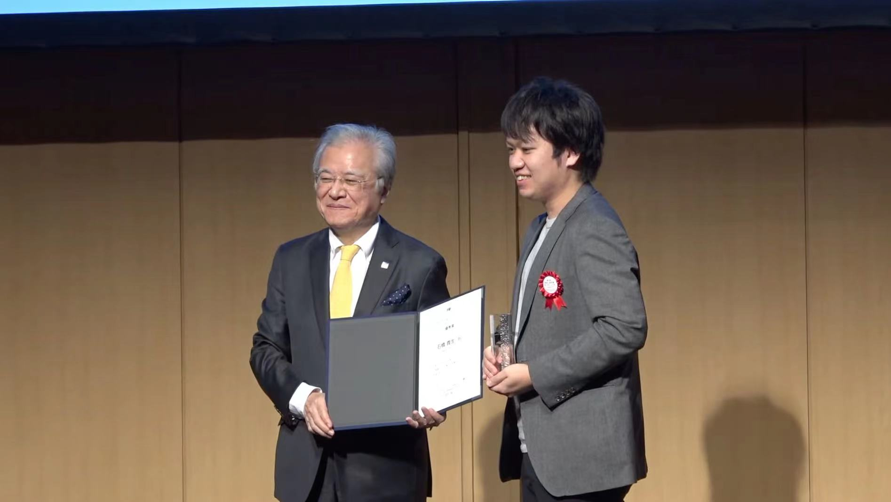

#### 最終更新：2023年3月

#### 住所：日本 東京

## 要約
社会人10年目のソフトウェアエンジニアです。現在3社目になります。
 
・最初の日系企業では、行政や企業様の大規模ストレージリソースを管理するためのソフトの開発に関わらせてもらいました。また、製品を使ってくれている自治体様のところに行き、現地のエンジニアチームと連携して業務システムの運用開発保守にも関わらせてもらいました。
 
・次のヨーロッパ系企業では、企業様のアプリケーションにおけるUXの向上やDXの実現をお手伝いをさせてもらいました。アプリケーションの拡張や、お客様の開発チームへのアジャイルコーチング、効果検証用の小規模データマートの構築に関わらせてもらいました。
 
・現在の欧米系企業では、いろいろな分野の企業様のDXの実現をお手伝いさせてもらっています。B2Cアプリの音声検索機能のPoCからプロダクト開発と業務設計、ECのフルリニューアル、CRMやデータマートのシステムやセキュリティルームなどの関連設備を含めた運用開発保守、機械学習ペイン分析業務アプリのスクラッチ開発、TV組み込みアプリのアーキテクトと開発などに関わらせてもらっています。
 
 
・プライベートでは、友人のスタートアップの手伝いや、小規模なWebアプリ開発を非定期的にしています。
 
・学生時代はスイスの[CERN](https://ja.wikipedia.org/wiki/%E6%AC%A7%E5%B7%9E%E5%8E%9F%E5%AD%90%E6%A0%B8%E7%A0%94%E7%A9%B6%E6%A9%9F%E6%A7%8B)とアメリカの[Fermilab](https://ja.wikipedia.org/wiki/%E3%83%95%E3%82%A7%E3%83%AB%E3%83%9F%E5%9B%BD%E7%AB%8B%E5%8A%A0%E9%80%9F%E5%99%A8%E7%A0%94%E7%A9%B6%E6%89%80)で加速器を使った素粒子の研究活動と、日本の[KEK](https://ja.wikipedia.org/wiki/%E9%AB%98%E3%82%A8%E3%83%8D%E3%83%AB%E3%82%AE%E3%83%BC%E5%8A%A0%E9%80%9F%E5%99%A8%E7%A0%94%E7%A9%B6%E6%A9%9F%E6%A7%8B)と共同で次世代加速器に使う検出器の放射線耐性の研究活動に関わらせてもらいました。  

## 略歴
| 期間 | 企業・組織 |
|:----|:----|
| 2018〜現在|[Accenture PLC](https://www.accenture.com/jp-ja)|
| 2017〜2018年（14ヶ月）|[Reacktor Japan 株式会社](https://reaktor.co.jp/)|
| 2016〜2017年（3ヶ月）|[日立製作所](https://ja.wikipedia.org/wiki/%E6%97%A5%E7%AB%8B%E8%A3%BD%E4%BD%9C%E6%89%80)　ITプラットフォーム事業本部　ソフトウェア開発部|
| 2016年（9ヶ月）|日立製作所　公共システム本部|
| 2013〜2015年（36ヶ月）|日立製作所　ITプラットフォーム事業本部　ソフトウェア開発部|
| 2012年（3ヶ月）|米国エネルギー省 フェルミ国立加速器研究所（Fermilab）|
| 2011年（3ヶ月）|欧州原子核研究機構（CERN）|
| 2011〜2013年（24ヶ月）|筑波大学大学院　数理物質科学研究科　物理学専攻|

 

## 職務履歴
### Accenture PLC

某電機メーカー様のTV組み込みアプリの開発（2022年6月～現在）
- 【概要】海外の開発チームと一緒に、次期モデルのTV組み込みアプリの実装と、アプリ・バックエンド間のプロキシのアーキ設計と実装、いくつかのバグフィックスを行った。
- 【規模】PJTメンバー：40人、年間TV販売台数：2000万台、ユーザ数：6000万人、販売リージョン：100ヵ国
- 【役割】チームリード、アプリエンジニア、アーキテクト
- 【技術スタック】Android、Android Studio、Coverity、Gerrit、Git、Gradle、Java、Jenkins、Kotlin
- 【その他】Scrum
 

某電気通信企業様のMLOps兼ペイン分析Webアプリの開発（2021年9月～5月）
- 【概要】 開発メンバーとして、Twitterの投稿データを使ったペイン分析と、投稿データを自動で分類するための機械学習および学習モデルを運用するためのWebアプリケーションを設計・スクラッチ開発しました。また開発チームリードとして、メンバーのタスク管理や成果物レビュー、スケジュール管理を担当しました。
- 【役割】 FEエンジニア、サーバサイドエンジニア、DBエンジニア、インフラエンジニア、チームリード、PM
- 【開発フレームワーク】 VanillaJS、RSCSS、Closure、RESTful API、SSD、RDS、NoSQL、Scrum
- 【言語】 Bash、CSS3、HTML5、JavaScript (ES5以上)、Python (3.x)
- 【規模】 HTML：5k LOC、JS：6k LOC、Python(APIサーバ)：1.5k LOC
- 【インフラ】 AWS
- 【AWS】 ACM、ASM、Amplify、Cognito、DynamoDB、EC2(VPNサーバ/APIサーバ)、Aurora、Step Functions、SageMaker
- 【バージョン管理】 AWS CodeCommit、Git、Git flow
- 【SSD】 OpenAPI、Responder、Swagger UI
- 【その他】 AWS SDK for Python (Boto3)、Bootstrap、ComboTree.js、DataTables、ElasticSearch、ESLint、FileSaver.js、Flask、Moment.js、jQuery、OpenVPN、Prettier、RFC6872、Stylelint、Systemd
 

某流通企業様のデータマートおよびデータウェアハウスの再構築（2021年3月～8月）
- 【概要】 DMおよびDWHと、それらに接続するセキュリティルームなどのセキュア環境を、オンプレミスおよびプライベートクラウドに移行した。リードエンジニアとして、特にインフラ領域において、オンプレミス上の制約やセキュリティ要件を満たすための技術的なハードルのアーキテクチャやソリューションの設計・実装を担当。また、チームのマネジメントやジュニアの育成、クライアントフェイシングを兼任。
- 【キーワード】 CRM、BI、業務システム、Webアプリ、データマート
- 【役割】 リードエンジニア、ソリューションアーキテクト、チームマネジメント、クライアントフェイシング、インフラエンジニア
- 【規模】 PJメンバー：60人、チームメンバー：5人、CRMエンドユーザ：2200万人、MAU：25万人、データマートのエンドユーザ：200人、VPS：50サーバ、DB：15インスタンス、DBテーブル：3000、DBテーブルレコード：1000万〜10億、バッチ処理：900ジョブ、セキュリティルーム：5拠点、ストレージ利用量：1.6PB、IAM：110ロール・90ポリシー
- 【開発フレームワーク】Waterfall、オンサイトまたはリモート
- 【言語】 Bash、batch script、JavaScript、Python
- 【インフラ】 AWS、クライアントのオンプレミス
- 【AWS】 IAM（AssumeRole/Service-linked）、Redshift、S3（オブジェクトロック/ライフサイクル設計）、EMR、Session Manager、その他（CloudWatch/EC2/Lambda/KMS/VPC）
- 【ミドルウェア】 Active Directory、CyberArk、Deep Security、Tableau、WPS Analytics
- 【ジョブツール】 Jenkins、JP1 AJS、JP1 Base
- 【監視ツール】 DataDog
 

某流通企業様のCRMシステムおよびデータマート・データウェアハウスのインフラ開発保守運用（2020年4月〜2021年2月）
- 【概要】 各システムのインフラと、それらに接続するセキュリティルームやオフィスのネットワーク整備などの物理的なインフラの設計構築・運用保守を行った。リードエンジニアとして、インフラ全般の技術的な対応、インシデントやセキュリティホールの調査・改善、セキュリティルーム新規構築やネットワーク環境の整備を担当。また、ジュニアの育成やクライアントフェイシングを兼任。
- 【キーワード】 CRM、B2B、業務システム、Web、データマート
- 【役割】 チームマネジメント、リードNWエンジニア、インフラエンジニア、SWエンジニア、クライアントフェイシング、ソリューションアーキテクト
- 【規模】 PJメンバー：100人、チームメンバー：5人、CRM対象アプリエンドユーザ：2000万人、MAU：20万人、データマートのエンドユーザ：150人、VPC：50サーバ、DB：15インスタンス、DBテーブル：3000、DBテーブルレコード：1000万〜15億、バッチ処理：900、セキュアルーム：5拠点、ストレージ利用量：1.6PB
- 【開発フレームワーク】 Waterfall、オンサイトまたはリモート
- 【言語】 Bash、batch script、Sass、HTML、JavaScript、Lua、Python
- 【インフラ】 AWS、セキュリティルーム、オフィススペース
- 【AWS】 Redshift、SSM、S3、その他（CloudWatch/EC2/IAM/Lambda/VGW）
- 【ミドルウェア】 Django、MySQL、OpenVPN、PostgreSQL、Squid
- 【ジョブツール】 Jenkins、JP1 AJS、JP1 Base
- 【監視ツール】 Zabbix
- 【サーバOS】 Amazon Linux、Windows Server 2016
- 【その他】 YAMAHAルータ(RTX810/830)
 

某流通企業様のカスタマーサポートセンターの業務システムとカスタマー行動データを活用したプロトタイプ検証（2020年1月〜3月）
- 【概要】 よりリアルタイムなカスタマーサポートUXを実現するために、SFDCのユーザ行動データとクライアントのデータウェアハウスのデータを統合・連携する仕組みについて事前検証を行った。リードエンジニアとして、バックエンドの実装全般を担当。サーバレスなREST APIのアーキテクチャ設計や、パフォーマンスのベンチマークおよびプロファイルの対応、またセキュリティ要件をクリアする方法など、技術的ハードル・業務要件的な課題の全般を担当。
- 【キーワード】 業務アプリ、PoC、サーバレス
- 【役割】 ソリューションアーキテクト、バックエンドエンジニア
- 【規模】 業務システムのエンドユーザー：200人、DB：5インスタンス、DBテーブル：300、DBテーブルレコード：100万〜10億、PJメンバー：30人
- 【開発フレームワーク】 Scrum、オンサイト
- 【言語】 Bash、Python
- 【インフラ】 AWS
- 【AWS】 Aurora、API Gateway、EC2、Lambda、Redshift、Step Functions
- 【ミドルウェア】 HPACK、PostgreSQL、OpenVPN、psycopg2、Salesforce Marketing Cloud
- 【その他】 Amazon Linux2、JMeter、Windows Server 2016
 

某小売企業様のECおよびEC関連の業務システムのフルリニューアルPJにおけるPJマネジメント（2019年8月〜11月）
- 【概要】 Web ECのフロントエンドとバックエンド、およびEC関連の物流や決済、在庫管理などの業務システムのフルリニューアルPJにおけるPJマネジメントを担当。サブマネージャーとして各レイヤーを横断的にフォローし、技術的あるいは業務的な障害の除去や課題解決のサポート、またPJマネジメント全般の業務を担当した。
- 【キーワード】 業務システム、Webアプリ、PJマネジメント
- 【役割】 PJマネジメント、Webエンジニア
- 【規模】 PJメンバー：300人、パートナー企業：10社、処理チケット数：3000件
- 【開発】 Waterfall、オンサイト
- 【言語】 Bash、JavaScript
- 【その他】 NodeJS、ReactJS、NextJS
 

某小売企業様のECシステムのスクラッチ開発と多言語化（2018年12月〜2019年7月）
- 【概要】 Web ECのデザインと関連機能のフルリニューアル、および英語・中国語・フィンランド語への多言語対応を行った。またリードエンジニアとして、開発チームへのアジャイルマニフェスト作成・コーチング、および技術選定・開発プロセスなどの設計や、各種実装、多言語化のための翻訳や文字列置換などのソリューション設計・作業自動化などを行った。加えてチームマネジメントと、PJマネジメント側との調整全般を兼務した。
- 【キーワード】 Webアプリ、多言語対応
- 【役割】 チームマネジメント、リードエンジニア、ソリューションアーキテクト
- 【規模】 チームメンバー：10人、EC画面数：600、JS LOC：7k、CSS LOC：10k、多言語対応：英語/フィンランド語/中国語、PJメンバー：200人
- 【開発フレームワーク】 Waterfall、Scrum、MVP、オンサイト
- 【言語】 Bash、CSS(Sass)、HTML、JavaScript、PHP7
- 【インフラ】 AWS
- 【ミドルウェア】 Gulp、jQuery、ReactJS、Redux、Puppeteer
- 【コーディングスタイル】 FLOCSS(CSS)、Material Web Design、Responsive Web Design、SSR
- 【その他】 Abstract(Sketchファイル管理)、JSX、NodeJS、SEO
 

某小売企業様のECモバイルアプリの新機能の実装と運用業務の構築（2018年10月〜2019年6月）
- 【概要】 GCPのVision APIを使った画像検索機能と、GCPのDialogflowおよびBaiduのUNITの音声認識サービス(日本語/中国語)と既存のEC検索システムを連携した音声検索機能のPoC評価・設計・実装・テストを行った、また音声認識の辞書データをメンテナンスするための運用業務の構築、およびクライアントへのコーチングなどのサービスイン関連全般を担当した。
- 【キーワード】 モバイルアプリ、Webアプリ、PoC、画像認識、音声認識
- 【役割】 チームマネジメント、リードエンジニア、インフラエンジニア、ソリューションアーキテクト、クライアントフェイシング
- 【規模】 チームメンバー：5人、PJメンバー：30人
- 【開発フレームワーク】 Waterfall、Scrum、MVP、オンサイト
- 【言語】 Bash、CSS、HTML、TypeScript、Java、Object-C
- 【インフラ】 AWS、GCP
- 【ミドルウェア】 GCP(Dialogflow/AssistantAPP/ProductSearch/VisionAPI)、Baidu(UNIT)
- 【その他】 NodeJS
  

### Reacktor Japan 株式会社
某飲料メーカ様のモバイルアプリのポイントチャージ機能のUX改善（2018年4月〜7月）
- 【キーワード】 モバイルアプリ、Webwプリ、PoC
- 【役割】 リードエンジニア、クライアントフェイシング
- 【規模】 PJメンバー：8人
- 【開発フレームワーク】 Scrum、RAD
- 【言語】 CSS、HTML、JavaScript
- 【その他】 Angular、Cordova、Google Analytics、OnsenUI
 

某飲料メーカー様のモバイルアプリのポイントチャージ機能の品質改善（2017年11月〜2018年4月）
- 【概要】 機能の品質問題からポイントチャージを横取りされる事象が発生していたため、横取りを追跡するためのシステムを構築し、その調査と改善を行った。
- 【キーワード】 モバイルアプリ、Webアプリ、データ分析
- 【役割】 クライアントフェイシング、リードエンジニア、データアナリシスト
- 【規模】 PJメンバー：19人
- 【開発フレームワーク】 RAD、Scrum
- 【言語】 Bourne Shell、Java、Object-C、TypeScript、Python
- 【インフラ】 AWS
- 【ミドルウェア】 Angular、Babel、Bootstrap、BSizeSDK、Cordova Plugin、MySQL、Omni Graffle、numpy、panda
- 【OS】 Android、Linux、iOS
- 【その他】 Android Debug Bridge、Cordova、Docker、Docker Compose、ElasticBeansTalk CLI、Google Analytics、Grunt、NodeJS、ReactJS、Received Signal Strength Indication、Xcode、gnuplot
 

フィンランドの某VRアプリの通信品質改善(2017年9月〜10月)
- 【キーワード】 Unity、VR、MVP開発
- 【役割】 Webエンジニア
- 【規模】 PJメンバー：7人
- 【開発フレームワーク】 RAD、Scrum、グローバルリモート
- 【インフラ】 AWS
- 【ミドルウェア】 GameLift、Lumberyard、Stream VR、Unity
- 【その他】 UDP Protocol、Ubuntu、User Story Board
 

某飲料メーカー様のモバイルアプリのBluetooth通信不具合のデバッグ(2017年7月〜9月)
- 【概要】 ポイントチャージする時の自販機とのBLE通信に不具合があり、その調査と改善を行った。
- 【キーワード】 BLE通信、MVP開発
- 【役割】 セールス、リードエンジニア、Webエンジニア
- 【規模】 PJメンバー：5人
- 【開発フレームワーク】 RAD、Scrum
- 【言語】 HTML、Java、TypeScript、Object-C、Bourne Shell
- 【インフラ】 AWS
- 【ミドルウェア】 Angular、BSizeSDK、ChartJS、Cordova、Deploy Gate、GemTotSDK、MySQL
- 【OS】 Android、Linux、iOS
- 【その他】 Grunt、NodeJS
 

某飲料メーカー様のモバイルアプリへの自販機位置情報取得機能と周辺飲食店コンテンツ表示機能の実装(2017年5月〜7月)
- 【キーワード】 DX改善、BLE通信、ポイントチャージアプリ、ホットペッパーグルメ
- 【役割】 Webエンジニア
- 【規模】 PJメンバー：24人
- 【開発フレームワーク】 RAD、Scrum、オンサイト
- 【言語】 CSS、HTML、TypeScript
- 【インフラ】 AWS
- 【ミドルウェア】 Angular、Cordova、Istanble、OnsenUI、PhantomJS
- 【OS】 Android、Linux、iOS
- 【その他】 Data Stusio、Deploy Gate、Google Analytics、Grunt、Mocha、NodeJS、OpenVPN、loadtest、supertest、カスタマージャーニーマップ、ペーパープロトタイプ
  

### 日立製作所
Hitachi Automation DirectorのUX改善のためのフロントエンド実装(2017年1月〜4月)
- 【キーワード】 Webアプリ、業務アプリ
- 【役割】 フロントエンドエンジニア
- 【規模】 PJメンバー：10人
- 【開発フレームワーク】 Scrum
- 【言語】 CSS、HTML、JavaScript
- 【その他】 Git、JIRA、Jenkins、SourceTree、jQuery
 

某自治体様の業務システムの設計構築・運用保守(2016年3月〜12月)
- 【キーワード】 業務システム
- 【役割】 チームリード、システムエンジニア、インフラエンジニア
- 【規模】 PJメンバー：8人
- 【開発フレームワーク】 Waterfall、オンサイト
- 【言語】 Power Shell
- 【その他】 JP1、VMWare、Windows Server 2015
 

Hitachi Command Suiteの商用ストレージNAT機能のサポート開発(2016年1月〜2月)
- 【キーワード】 業務アプリ
- 【役割】 プロダクト開発エンジニア
- 【規模】 PJメンバー：10人
- 【開発フレームワーク】 Scrum
- 【言語】 Java
- 【その他】 JIRA、Git、Linux、VMWare、Windows server 2013
 

JP1 v11のAWSオートスケールのサポート開発(2015年10月〜2016年1月)
- 【キーワード】 業務アプリ
- 【役割】 プロダクト開発エンジニア、チームリード
- 【規模】 PJメンバー：5人
- 【開発フレームワーク】 Waterfall
- 【言語】 Power Shell
- 【その他】 AWS、JP1、Linux、Windows Server 201x
 

Hitachi Command Suite v8.0.１〜8.1のノイジーネイバー特定機能の開発(2014年6月〜2015年7月)
- 【概要】 SAN上のノイジーネイバーを特定するための機能の要件定義〜実装、またそれらを題材とした社内論文の執筆。
- 【キーワード】 業務アプリ、ミドルウェア
- 【役割】 PJマネジメント、プロダクト開発エンジニア
- 【規模】 PJメンバー：30人
- 【開発フレームワーク】 Waterfall
- 【言語】 Java
- 【その他】 ClearCase、Eclipce、SubVersion
 

Hitachi Command Suite v8.0のGUIの実装(2014年1月〜6月）
- 【概要】 サポート商用ストレージのマルチプロセッサブレードの性能分析用GUIの実装。
- 【キーワード】 業務アプリ、フロントエンド
- 【役割】 プロダクト開発エンジニア
- 【規模】 PJメンバー：40人
- 【開発フレームワーク】 Waterfall
- 【言語】 ActionScript、MXML
- 【その他】 Adobe Flex、Eclipce、ClearCase、SubVersion
 

Hitachi Command Suite v7.9のAPIの設計と実装(2013年9月〜2014年1月)
- 【キーワード】 業務アプリ、RESTful、API、ミドルウェア
- 【役割】 プロダクト開発エンジニア
- 【規模】 PJメンバー：50人
- 【開発フレームワーク】 Waterfall
- 【言語】 Java
- 【その他】 ClearCase、Eclipce、MySQL、SubVersion
 
 

## サイドプロジェクト
公共バスのリアルタイム到着時刻表示アプリの個人開発 [優秀賞] (2021年10月)

  

- 【概要】 第4回東京公共交通オープンデータチャレンジの応募作品
- 【アプリ動画】 https://m.youtube.com/watch?v=j65LiCI5G_0
- 【アプリURL】 https://xtaka.github.io/app/IGWkYCxmpbbb/
- 【役割】 Webエンジニア
- 【規模】 2k SLOC
 

音声コンテンツ共有SNS Webアプリの個人開発(2018年3月〜2019年3月)
- 【役割】 Webエンジニア
- 【規模】 4k SLOC
- 【開発フレームワーク】 RAD、Scrum
- 【プログラミング言語】 PHP、CSS、HTML、Java、Bourne Shell、JavaScript (TypeScript/ReactJS/NodeJS)
- 【ミドルウェア】 Erasticsearch、Flux、MySQL、Jest、Mocha、Express、Redux
- 【インフラ】 AWS
- 【その他】 Docker、Docker-Compose、Webpack、loadtest、supertest
 

Seedステージの某スタートアップのWebチャットアプリ試作の実装(2017年1月〜3月)
- 【役割】 Webエンジニア
- 【規模】 PJメンバー：5人
- 【開発フレームワーク】 Scrum
- 【プログラミング言語】 Elixir、JavaScript
- 【ミドルウェア】 MuSQL、Phoenix、Nginx
- 【インフラ】 AWS
- 【その他】 Eslint、Ubuntu、babel、gulp、flow、webpack
 

Earlyステージの某スタートアップのWebスクレーピングアプリ試作の実装(2016年10月〜12月)
- 【役割】 Webエンジニア
- 【規模】 PJメンバー：7人
- 【開発フレームワーク】 Scrum
- 【プログラミング言語】 HTML、JavaScript、PHP
- 【ミドルウェア】 cURL
 

Seedステージの某スタートアップECサイトの決済機能の実装(2016年2月〜4月)
- 【役割】 リードエンジニア
- 【規模】 PJメンバー：3人
- 【開発フレームワーク】 Waterfall
- 【プログラミング言語】 HTML、JavaScript、PHP
- 【ミドルウェア】 Paypal
- 【インフラ】 AWS
 

ストリーミングWebアプリ(2015年10月〜2016年2月)
- 【役割】 Webエンジニア
- 【規模】 アプリソース：6k SLOC、PJメンバー：2人
- 【開発フレームワーク】 Scrum
- 【プログラミング言語】 CSS、HTML、JavaScript、PHP
- 【ミドルウェア】 Apatch、MySQL
- 【インフラ】 AWS
 

社内の個人Wiki横断検索Webアプリ(2015年6月〜9月)
- 【役割】 Webエンジニア
- 【規模】 アプリソース：2k SLOC、PJメンバー：3人
- 【開発フレームワーク】 Waterfall
- 【言語】 HTML、Java
- 【ミドルウェア】 Tomcat、TiddlyWiki
  

## テクニカルスキルと経験年数
(＊)：最近よく使ってるもの
TODO
| カテゴリ | 1年以上 | 1年未満 |
|:--------|:-------|:-------|
|OS|Amazon Linux(＊)、WSL(＊)|Android、iOS|
|プログラミング言語|Bash(＊)、Bourne Shell、C(＊)、CSS、HTML、Java(＊)、JavaScript(＊)、PHP、TypeScript|Action Script、C++、Elixir、Go、Lua、MXML、ObjectC|
|フロントエンド|Flux、ReactJS、Redux|Angular、Cordova、Bootstrap、OnsenUI、Saas、Service Worker、WebRTC、flow|
|バックエンド|Apatch、Express、MySQL、NodeJS|Phoenix、Python、Tomcat、Unity、Nginx、Windows cmd.exe|
|インフラ|AWS(＊)|GCP、Vulture|
|DB|MySQL、PostgreSQL|-|
|エディタ|Atom、Eclipce、SublineText、Visual Studio Code(＊)、vi、vim(＊)|Android Studio|
|OSS|Elasticsearch|Apatch Superset|
|タスク管理|Kanban、Trello|Azure DevOps、JIRA(＊)、Taiga|
|開発フレームワーク|Agile、RAD、Scrum(＊)、TDD(＊)、Waterfall|SDD (Schema-Driven Development)(＊)、XP|
|リポジトリサービス|GitHub(＊)|Gitlab、GitBucket、SubVersion|
|バージョン管理|ClearCase、Git(＊)|-|
|パッケージ管理|npm、yarn|apt(＊)|
|タスクランナー|gulp|Grunt、Jenkins、JP1/AJS|
|トランスコンパイラー|babel|-|
|課題管理|-|Redmine|
|監視|-|Zabbix、DataDog|
|バンドラー|Webpack|-|
|テスト|Chai、Mocha、supertest|Enzyme、istanble、Jest(＊)、PhantomJS、Sinon|
|ローカルCI|eslint|-|
|コンテナー|-|Docker、Docker Compose|
|デザインパターン|Responsive Web Design|Progressive Web Design、Scheme|
|その他|AWS CLI(＊)|ElasticBeansTalk CLI、Terraform、XCode、YAMAHAルータ(RTX810/830)、tmux、gcc、gdb|
 

## 語学
- 日本語：母国語
- 英語：日常会話〜ビジネス初級
- 中国語：日常会話
  

## 資格
中国語検定 HSK 2級
TOEICスコア 615
  

## 最終学歴
筑波大学大学院　数理物質科学研究科　物理学専攻　2013年3月卒
  

## その他 
- GitHub：[xtaka](https://github.com/xtaka)
- 趣味：[中国琴](https://www.youtube.com/watch?v=mlL4GGzxAK4)、[チャイルドスポンサーシップ(エチオピア)](https://www.worldvision.jp/childsponsor/)、[国内ひとり親家庭フードバンク](https://www.gnjp.org/work/domestic/gohan/)
- 関心があるもの：
  - Individual Contributor
  - Carbon、OSS活動、Rust、SOLID、アクアポニックス、量子情報(Q-LEAP/QII)
  - 貧困児童問題
